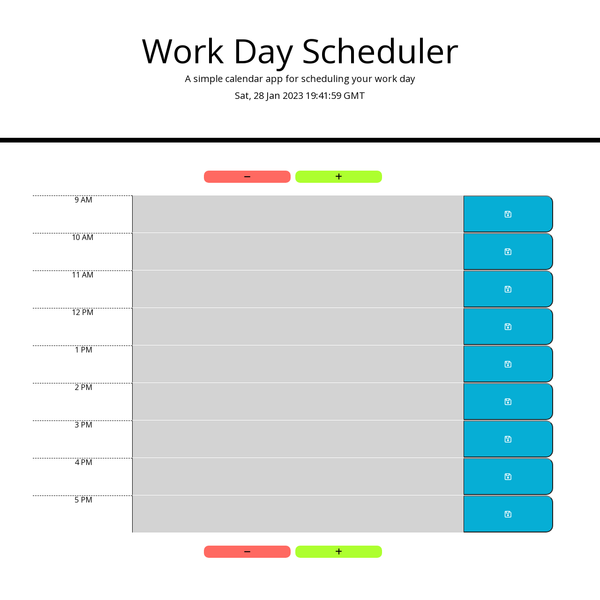

# Bootcamp Challenge 7 - Work Day Scheduler

## Description 

This project was created using HTML, CSS, Javascript and JQuery to make a Work Day Scheduler. The project had the following requirements:

* Display the current day at the top of the calender when a user opens the planner.
* Present timeblocks for standard business hours when the user scrolls down.
* Color-code each timeblock based on past, present, and future when the timeblock is viewed.
* Allow a user to enter an event when they click a timeblock.
* Save the event in local storage when the save button is clicked in that timeblock.
* Persist events between refreshes of a page.

The page in this repo is the result.

## Installation

The site does not require installation steps.

## Usage 

The website can be viewed at [https://bowseruk.github.io/work-day-scheduler/](https://bowseruk.github.io/work-day-scheduler/) with Google Chrome. The source can be viewed in Chrome by right clicking and selecting inspect.

## Credits

This site was based on a project by edX Boot Camps LLC.

[W3School](https://www.w3schools.com/) was used as a reference for elements to use and good practice.

The changes were checked with [W3C Validator](https://validator.w3.org/).

[Stack Overflow](https://stackoverflow.com/) always seems to have the answer to a problem that occurs.

[MDN](https://developer.mozilla.org/en-US/) is a very comprehensive and useful resource.

[JQuery API](https://api.jquery.com/) documentation was useful.

## License

This project uses the licence in the LICENCE file of the repo.
